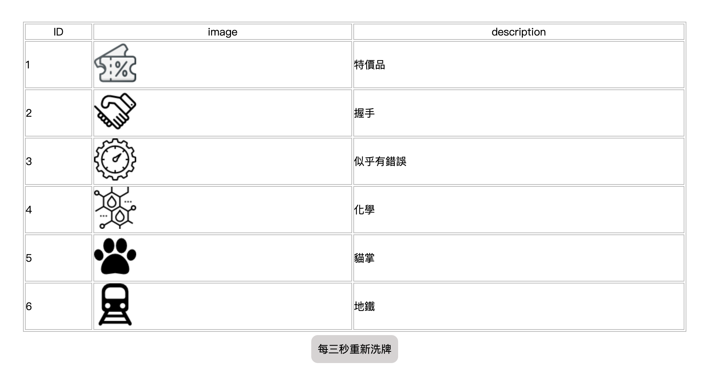
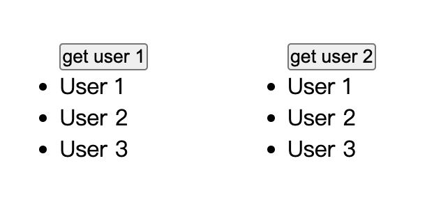

<!-- 可按shift + command + v 預覽md檔 -->
# 請實作下列測驗

### 測驗一 (請在src/views/test1.vue中作答)

- api: https://node-vercel-delta-one.vercel.app/api/test1
- 素材: /public/images/

1. 將api回覆的資料製作成一個表格，其中圖片可在/public/images中找到。

2. 圖片連結錯誤時，使用/public/images/default.png圖片。

3. 新增一個功能按鈕，每3秒將表格資料隨機排序。

### 測驗二 (請在src/views/test2.vue中作答)

- api_A: https://node-vercel-delta-one.vercel.app/api/test2
- api_B: https://node-vercel-delta-one.vercel.app/api/test2-1
- api_C: https://node-vercel-delta-one.vercel.app/api/test2-2
- api_D: https://node-vercel-delta-one.vercel.app/api/test2-3

1. 實作一個按鈕，點擊後可呼叫在(pinia/vuex)中實作的函式，函式為呼叫api_A，並將回傳結果渲染出來。

2. 承上題，實作第二個按鈕，呼叫api_B、api_C、api_D：
實作只有在三個api皆回覆status:200時才渲染，並於渲染後提示使用者。

3. 實作一個方法，可以防止上述兩顆按鈕連點(直到api回覆才可再次點選)。

### 測驗三 (在src/views/test3.vue中作答)
1. 取得當前可視範圍內元素的index。

2. 實做功能，當滑動到可視範圍，才渲染元素。